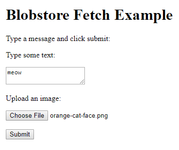

This project uses Blobstore to allow the user to upload an image.

The `index.html` file contains JavaScript that uses the `fetch()` function to
request the Blobstore URL from the server. The JavaScript then sets the `action`
of the form to point to the Blobstore URL. This allows us to build the HTML of
the page, without resorting to printing out a bunch of HTML from a servlet.

