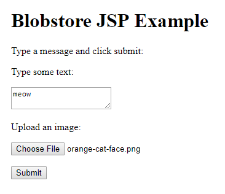

This project uses Blobstore to allow the user to upload an image. It uses JSP to
insert the Blobstore URL into the HTML of the page, without resorting to
printing out a bunch of HTML from a servlet.

