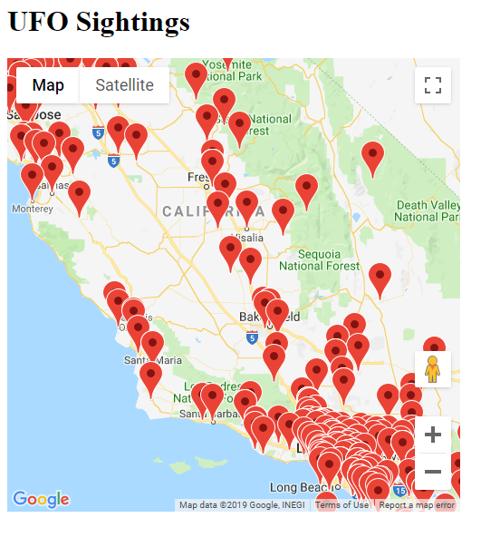
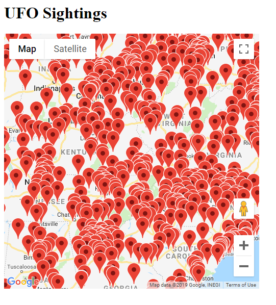

This project displays a map that shows UFO sightings.

The data is stored in the `ufo-data.csv` file, but could also come from
Datastore or some other database. The data is loaded and formatted into JSON in
`UfoDataServlet`, and `index.html` contains JavaScript that fetches this data
and adds it to a map using the Google Maps API.

UFO data came from [here](https://data.world/timothyrenner/ufo-sightings) which
I found by searching on
[Google Dataset Search](https://toolbox.google.com/datasetsearch).

You can run this locally by executing this command:

```bash
mvn package appengine:run
```




